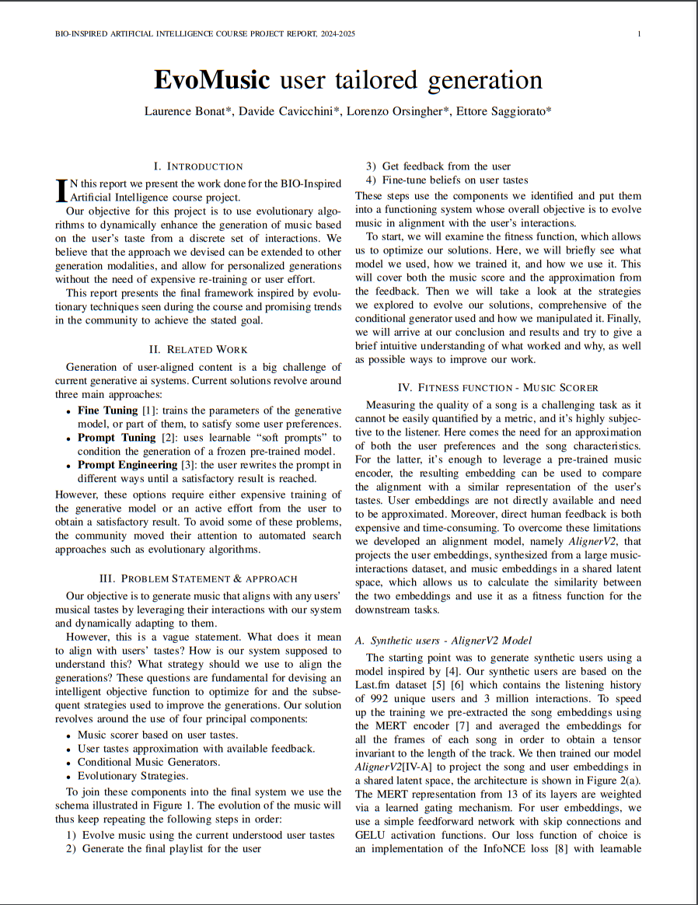
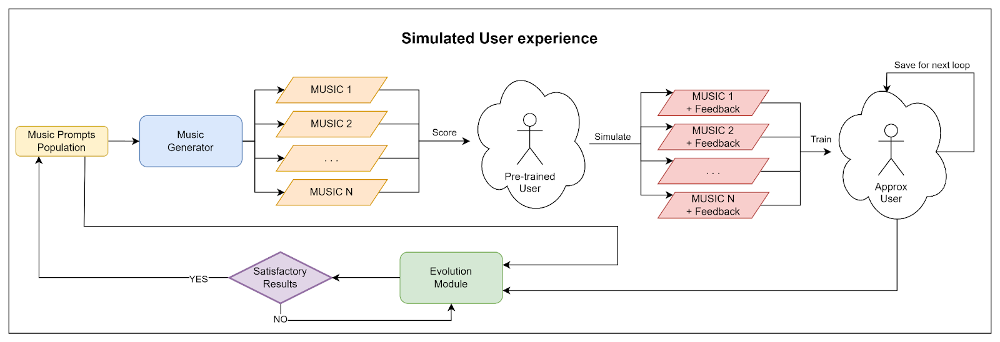
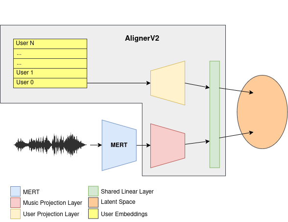
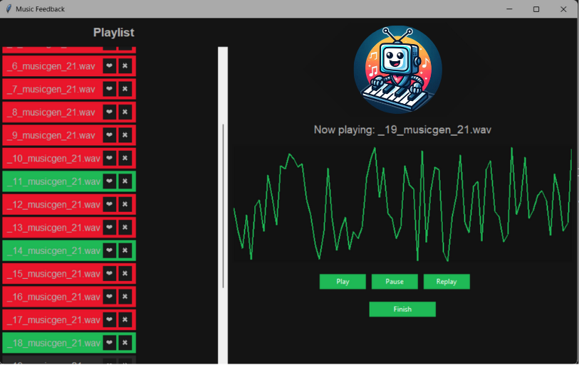

# EvoMusic

<p align="center">

</p>

## What is EvoMusic?

EvoMusic is an adaptive music generation system designed to evolve music in alignment with user preferences. By analyzing user interactions, it continuously refines its understanding of musical tastes and generates personalized compositions.

At its core, EvoMusic combines a music scoring mechanism, user feedback modeling, conditional music generation, and evolutionary strategies. The system follows a loop where it evolves music based on inferred preferences, generates a playlist, collects feedback, and fine-tunes its understanding of user tastes. This iterative process ensures that the music adapts dynamically to each user.

More details about the project can be found in the technical report:

<p align="center">
<a href="https://github.com/lorenzoorsingher/EvoMusic/blob/main/EvoMusic_report.pdf"></a>
</p>
<p align="center">
Click to download report
</p>

## Project Structure

```
├── EvoMusic
│   ├── evolution
│   │   ├── evolve.py
│   │   ├── fitness.py
│   │   ├── logger.py
│   │   ├── operators.py
│   │   ├── problem.py
│   │   └── searchers.py
│   ├── music_generation
│   │   ├── generators.py
│   │   ├── init_prompts.txt
│   │   ├── musicgen_server.py
│   │   ├── musicLDM_server.py
│   │   └── riffusion_server.py
│   ├── user_embs
│   │   └── model.py
│   ├── usrapprox
│   │   ├── models
│   │   │   └── usr_emb.py
│   │   └── utils
│   │       ├── dataset.py
│   │       ├── memory.py
│   │       ├── user_manager.py
│   │       ├── user.py
│   │       ├── user_train_manager.py
│   │       └── utils.py
│   ├── application.py
│   └── configuration.py
├── generated_audio
│   └── ...
├── img
├── usrapprox
│   └── ...
├── usrembeds
│   ├── checkpoints
│   │   └── ...
│   ├── data
│   │   └── ...
│   ├── datautils
│   │   └── dataset.py
│   ├── exp
│   ├── models
│   │   ├── __init__.py
│   │   └── model.py
│   ├── align.py
│   ├── embedgen_MERT.py
│   ├── embedgen.py
│   ├── __init__.py
│   ├── main.py
│   ├── test.py
│   └── utils.py
├── visualizations
│   ├── music_embedding.py
│   └── users.py
├── application.py
├── evolution_pipeline.py
├── README.md
└── setup.py
```

## Implementation

<p align="center">

</p>

The EvoMusic pipeline aims to generate music tailored to user preferences using **evolutionary algorithms**. It avoids costly retraining and excessive user input by dynamically refining generated music through interactions. The system integrates four key components: a **music scorer** that evaluates alignment with user tastes, an **approximation model** that infers user preferences from feedback, a **conditional music generator**, and **evolutionary strategies** to refine music iteratively.

Music evolution employs both text-based prompt optimization and direct embedding optimization. The prompt-based approach utilizes large language models (LLMs) to refine text prompts through evolutionary techniques like roulette-wheel selection, novelty injection, and elite retention. Two strategies were tested: Full LLM, which optimizes prompts via meta-prompt reasoning, and LLM Evolve, which applies genetic operators like crossover and mutation to text prompts.

Embedding optimization directly manipulates the token embeddings used in the conditional music generator. Methods tested included **CMA-ES**, **SNES**, and **genetic algorithms**, all of which search the latent space for optimized solutions. Genetic algorithms showed promise in balancing exploration and exploitation, while numerical techniques struggled due to the sparsity of the embedding space.

<p align="center">

</p>

This work addresses the challenge of measuring song quality, which is subjective and difficult to quantify. We propose **AlignerV2**, a model that aligns user and music embeddings in a shared latent space, allowing similarity calculations between them. Since real user embeddings are not available, synthetic user embeddings are generated from a large dataset of music interactions (Last.fm). The MERT encoder is used to extract music embeddings, leveraging all 13 hidden layers through a gating mechanism. Finally, we can calculate the similarity between user and music embeddings, allowing us to approximate a fitness function for the downstream tasks.
AlignerV2 is trained with contrastive learning using InfoNCE loss with learnable temperature

<p align="center">

</p>

We implemented a GUI in order to facilitate the user interaction with the system. The GUI allows the user to listen to the generated music and provided feedback. An emergent behavior surfaced by injecting real human feedback in the loop was a great improvement in the quality of the generated music for the numerical optimization methods, where the synthesized feedback would sometimes fail to weed out noisy solutions.

## Installation

To install the required pa[c](https://github.com/lorenzoorsingher/EvoMusic/blob/main/EvoMusic_report.pdf)kages, run the following commands:

Create and activate conda environment with Python 3.10:

```bash
conda create -n evomusic python=3.10
conda activate evomusic
```

Install the required packages via `setup.py`:

```bash
pip install -e .
```

Ensure the needed files are in the correct directories:

- [_AlignerV2_best_model.pt_](https://drive.google.com/file/d/16cFjul9jPlEb7oPlQtwNmjcB7cZlm6Ht/view?usp=sharing) in `usrembeds/checkpoints/` checkpoint
- [_embeddings_full_split_](https://drive.google.com/file/d/eeeh/view?usp=sharing) in `usrembeds/data/embeddings/`

## Usage

To run the application you need to provide to `evolution_pipeline.py` a valid configuration file. The configuration file is in YAML format and contains the field that describes the parameters of the pipeline. An example of a configuration file is available under the directory `example_conf/`.

```bash
python evolution_pipeline.py --config_path example_conf/config.yaml
```

### Configuration

In the configuration file it's possible to specify what music generation model to use in the pipeline, EvoMusic supports two different models: **Riffusion** and **MusicGen**, both can be configured and the parameter `music_model` dictates which one to use.

```yaml
music_generator:
  model: "facebook/musicgen-small"
  input_type: "text"
  output_dir: "generated_audio"
  name: "musicgen"

riffusion_pipeline:
  input_type: "text"
  output_dir: "generated_audio"
  name: "riffusion"
  inference_steps: 50

music_model: "musicgen"
```

- `input_type` specifies the type of input that the model expects, it can be either **text**, **embedding** or **token_embdedding**.
- `output_dir` specifies the directory where the generated audio files will be saved.

In `user_model` it's possible to configure the user embedding model, the user configuration and the training configuration.

```yaml
user_model:
  aligner:
    abs_file_path: "usrembeds/checkpoints/AlignerV2_best_model.pt"
  user_conf:
    memory_length: 50
    amount: 1
    init: "rmean" # mean rand rmean
  train_conf:
    lr: 0.001
    epochs: 5

  best_solutions: 10

  users:
    - user_type: "synth"
      target_user_id: 0
```

- `aligner` specifies the path to the alignment model checkpoint.
- `user_conf` specifies the configuration of the user embedding model, it's possible to specify the `memory length` (the number of previous generations to consider in the approximated user training), the `amount` (the number of users to approximate)and the `init` method which specifies how to initialize the user embedding. It can be either **mean** (initialize the user embedding with the average of all the synthesized users), **rand** (initialize the user embedding with random values) or **rmean** (same as mean but with random noise).
- `train_conf` specifies the training configuration of the user embedding model, it's possible to specify the `learning rate` and the number of `epochs`.
- `best_solutions` sets the number of best solutions from each generation to be user for the user embedding approximation.
- `users` specifies the users to approximate, it's possible to specify the `user_type` which can be either **synth** or **real** and the `target_user_id` which specifies id of the user to approximate among the 987 available.

Under the evolution section of the configuration file we can specify the parameters of the genetic algorithm as well as the logging and LLM options.

```yaml
evolution:
  exp_name: "base"

  generations: 5

  max_seq_len: 25
  duration: 1
  best_duration: 3

  device: "cpu"

  initialization: "file"
  init_file: "EvoMusic/music_generation/init_prompts.txt"

  logger:
    wandb: True
    project: "MusicEvo"

    wandb_token: "WANDB_TOKEN"

    visualizations: False

  LLM:
    api_key: "API_KEY"
    temperature: 0.7
    model: "gpt-4o-mini"
    api_uri: "https://api.openai.com/v1/chat/completions" # needs to be an OpenAI API compatible endpoint
```

- `exp_name` specifies the name of the experiment.
- `generations` specifies the number of generations that the genetic algorithm will run **for each evolve step**.
- `max_seq_len` specifies the maximum length in tokens of the generated sequence (including 2 tokens for the start and end tokens).
- `duration` specifies the duration of the generated audio files in seconds.
- `best_duration` specifies the duration in seconds of the best solution for each generation.
- `device` specifies the device to use for computation for the evolutionary strategy.
- `initialization` specifies the initialization method for the population, it can be either **LLM** or **file**. If the initialization is set to **file** the `init_file` parameter specifies the path to the file containing the initial prompts, otherwise the **LLM** section specifies the parameters for the LLM initialization, any OpenAI API compatible endpoint can be used.
- `logger` specifies the logging options for the pipeline, it's possible to log the results to WandB and to save the visualizations of the population, it's recommended to set **wandb** to **True** and to provide a valid WandB token.

```yaml
fitness:
  mode: "user" # can either be user, music or dynamic
  target_music: "" # path to the target music for mode music
  noise_weight: 0.5 # noise weight for the fitness function
```

- `mode` specifies the mode of the fitness function, it can be either **user**, **music** or **dynamic**. If the mode is set to **user** the fitness function will use as target the user embedding specified in the `user_model` section, if the mode is set to **music** the fitness function will use as target the music specified in the `target_music` field, if the mode is set to **dynamic** the fitness function will use the dynamically approximated user embedding.
- `noise_weight` specifies the weight of the penalty for the noise and artifacts in the generated audio, it's not recommended using it with **LLM** and **LLM evolve** modes.

Under the `search` section you can specify the parameters of the evolutionary strategy, the available modes are **LLM evolve**, **full LLM**, **GA**, **CMAES** and **SNES**.

```yaml
search:
  mode: "LLM evolve"

  # general search parameters
  population_size: 100

  sample: True
  temperature: 0.1 #(note: the original values are [-1,1] so we advise lower values)
  novel_prompts: 0.1
  elites: 0.1
```

- `mode` specifies the mode of the evolutionary strategy, it can be either:
  - **full LLM** which uses the LLM to generate the whole population and performs the evolutions and crossover, the prompt can be set via the _full_LLM_prompt_ field.
  - **LLM evolve** which uses the LLM to generate the initial population and then evolves it using LLM-based operators that will be defined in the _LLM_genetic_operators_ section.
  - **GA** which uses the genetic algorithm to evolve the population.
  - **CMAES** which uses the CMAES algorithm to evolve the population.
  - **SNES** which uses the SNES algorithm to evolve the population.

GA, CMAES and SNES use the **evotorch** library implementation of the algorithms.

- `population_size` specifies the size of the population.
- `sample` specifies whether to use sampling for all operations. _[LLM modes only]_
- `temperature` specifies the temperature to use for the sampling. _[LLM modes only]_
- `novel_prompts` specifies the fraction of the population to create ex-novo. _[LLM modes only]_
- `elites` specifies the fraction of the population to keep from the previous generation.

In order to be interpreted by EvoMusic, the prompt for the **full LLM** mode must be formatted as follows:

```yaml
    full_LLM_prompt:
    "Generate {num_generate} music prompts ...

Here is the current population with their similarity scores and ranking for the current generation:
{ranking}

after the reasonin, generate only the next generation of prompts with a population of {num_generate} prompts."
```

More detailed instructions can be added in the prompt as long as it follows the same general structure as the example above.

For what concerns the **LLM evolve** mode, the genetic operators can be defined in the configuration file under the `LLM_genetic_operators` field. The operators are applied to the whole population one by one sequentially, and you can create operators that apply multiple operations at the same time by describing what you want the LLM to do. Do not use anywhere the <propt> </prompt> tags, as they are used to extract the final output from the LLM

```yaml
# LLM evolve parameters
tournament_size: 5 # size of the tournament for selection
LLM_genetic_operators:
  # genetic operators to use when using the LLM evolve mode

  - name: "cross over"
    prompt: "take the two prompts provided and cross them over by mixing components of both {prompts}"
    input: 2 # number of parents
    output: 1 # number of children
    probability: 0.5 # the probability of applying the operator
  - name: "change genere"
    prompt: "take the prompt and change the genre of the music used {prompts}"
    input: 1 # number of parents
    output: 1 # number of children
    probability: 0.5
  - name: "random mutation"
    input: 1 # number of parents
    output: 1 # number of children
    prompt: "take the prompt and mutate it, you can choose to mutate any of the words in the prompt {prompts}"
    probability: 0.5
```

- `name` specifies the name of the operator.
- `prompt` specifies the prompt to use for the operator, so the operation that the LLM should perform.
- `input` specifies the number of parents that the operator needs.
- `output` specifies the number of children that the operator will generate.
- `probability` specifies the probability of applying the operator.

When using GA, CMAES or SNES the parameters can be defined under the `evotorch`field, any parameter available in the evotorch library can be specified here.

```yaml
evotorch: # additional parameters for the search algorithm when using evotorch's algorithms
  elitist: True

GA_operators:
  - name: "OnePointCrossOver"
    parameters:
      tournament_size: 4
      cross_over_rate: 0.5
  - name: "GaussianMutation"
    parameters:
      stdev: 20
```

- `elitist` specifies whether to use elitism in the algorithm, if set to false it will override the `elites` parameter in the `search` section.
- `GA_operators` specifies the genetic operators to use when using the GA algorithm, the available operators are **OnePointCrossOver**, **GaussianMutation**, **CosynePermutation**, **MultiPointCrossOver**, **PolynomialMutation**, **SimulatedBinaryCrossOver** and **TwoPointCrossOver**. Check the documentation of the `evotorch` library for more information on the parameters of the operators.

## Authors

- [@DavidC001](https://github.com/DavidC001)
- [@lorenzoorsingher](https://github.com/lorenzoorsingher)
- [@sa1g](https://github.com/sa1g)
- [@blauer4](https://github.com/blauer4)
- [GitHub repo](https://github.com/lorenzoorsingher/EvoMusic)
